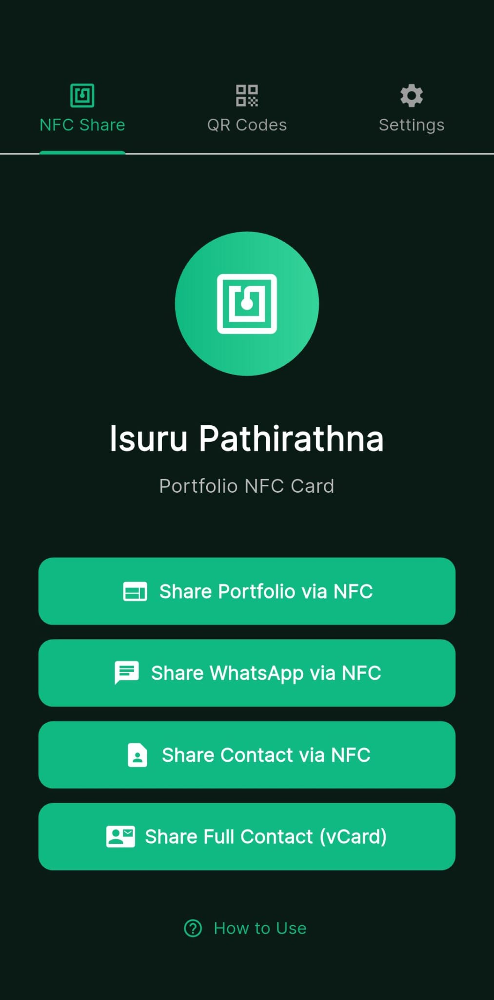
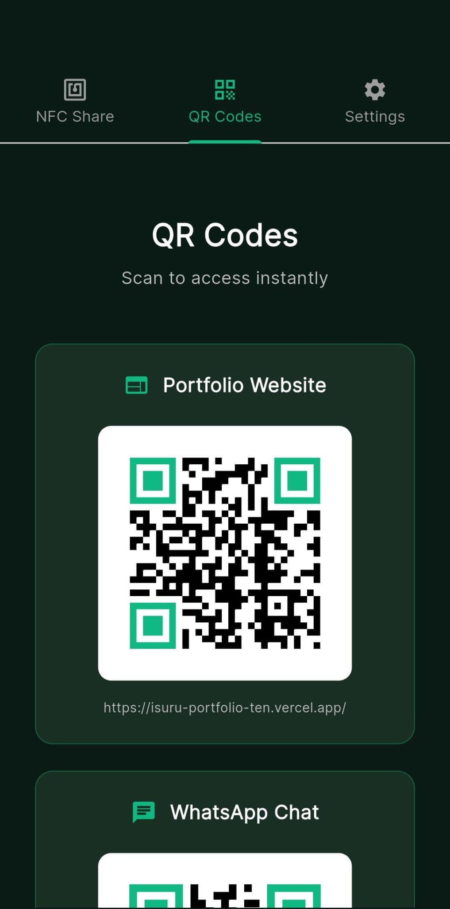
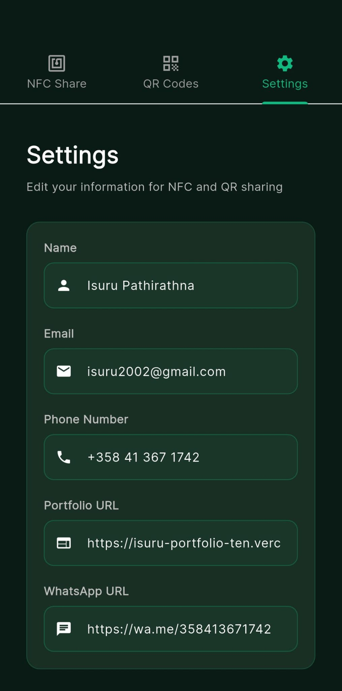

# NFC Business Card

Share your contact info and portfolio instantly using NFC or QR codes.

## Screenshots

<p align="center">
  
  
  
</p>

## Features

**NFC Sharing** - Share 4 different things via NFC:
- Portfolio website
- WhatsApp direct message link  
- Quick contact (name + phone)
- Full vCard (name, phone, email, website)

**QR Codes** - Same 4 options as QR codes for easy scanning

**Settings** - Edit all your info in one place:
- Name
- Email
- Phone number
- Portfolio URL
- WhatsApp URL

**Saves Your Data** - Everything you enter is saved locally on your phone

## How to Use

1. Open the app
2. Go to Settings tab and enter your info
3. Tap Save
4. Go to NFC tab, tap a share button
5. Hold your phone back-to-back with another phone
6. They get your info instantly

## Installation

```bash
flutter pub get
flutter run
```

## Build Production APK

```bash
flutter build apk --release
```

Split by architecture (smaller files):
```bash
flutter build apk --release --split-per-abi
```

## Tech Stack

- Flutter 3.38.3
- Java 21 LTS
- Android Gradle Plugin 8.9.1
- Gradle 8.12
- Kotlin 2.1.0
- HCE (Host Card Emulation) for NFC
- NDEF with proper MIME types for vCard
- SharedPreferences for local storage

## Requirements

- Android phone with NFC
- Flutter 3.38.3+
- Java 21 LTS
